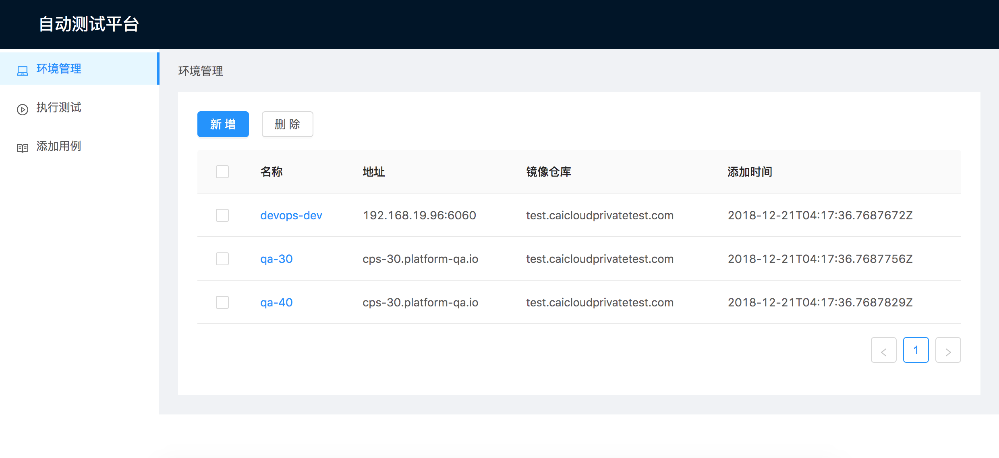

# Smart QA

Smart QA helps you to test your applications automatically.

## Quick Start

### Build

```bash
$ make container
```

### Run

```bash
$ docker-compose -f docker-compose.yml up -d
```

Then access from `http://localhost:8888`

## Components

### Server

Server provides RESTful APIs to manage environments, test cases and trigger tests.

### Web

Web provides UI interfaces for this auto test platform.


